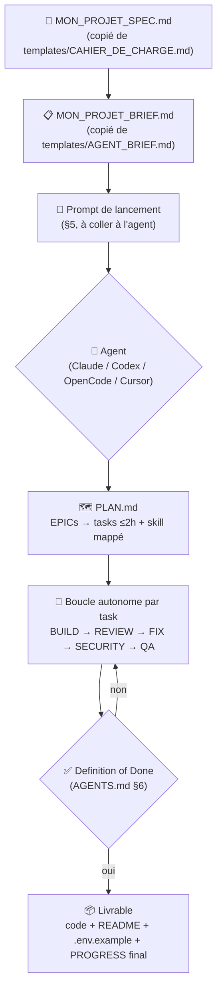
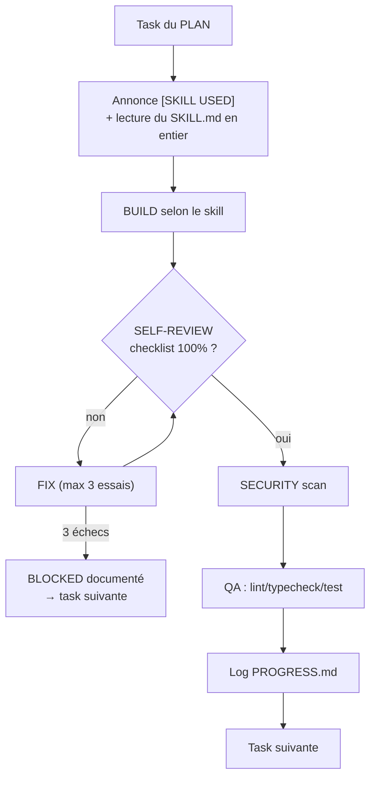
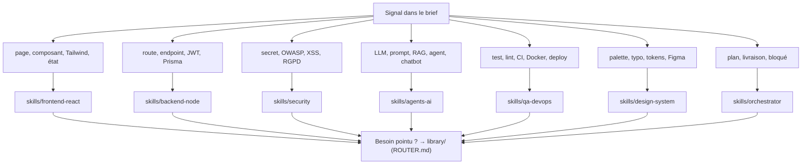
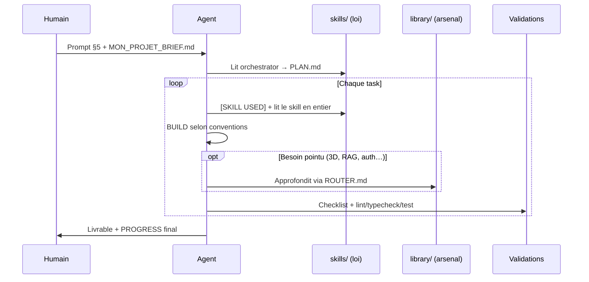

# AI Factory Monorepo — Documentation complète

> FR: Ce repo est une **usine à agents**. Tu donnes un cahier de charge à un agent IA, il travaille en autonome — avec les bons skills, jusqu'à livraison.
> EN: This repo is an **agent factory**. Give a spec to an AI agent and it works autonomously — with the right skills, until delivery.

---

## Sommaire

1. [Vision & architecture](#1-vision--architecture)
2. [Cloner et installer](#2-cloner-et-installer-10-min)
3. [Écrire ton cahier de charge (+ exemple rempli)](#3-écrire-ton-cahier-de-charge-15-min)
4. [Brancher ton agent (+ exemple de brief rempli)](#4-brancher-ton-agent-5-min)
5. [Lancer la livraison](#5-lancer-la-livraison-le-prompt-à-coller)
6. [Suivre l'avancement](#6-suivre-lavancement-sans-le-déranger)
7. [Réceptionner le livrable](#7-réceptionner-le-livrable)
8. [Ressources : catalogue, liens, trouver des skills](#8-ressources--catalogue-liens-trouver-des-skills)
9. [Dépannage / FAQ](#9-dépannage--faq)

---

## 1. Vision & architecture

### 1.1 Le problème résolu

Coder avec l'IA sans cadre donne du code vite fait, non testé, non sécurisé, impossible à reprendre. La factory inverse le rapport : **l'humain écrit le QUOI (spec), l'agent exécute le COMMENT sous loi écrite**, avec auto-contrôle obligatoire. Résultat : une livraison testée, sécurisée, documentée — pas un prototype.

### 1.2 Les 3 couches

```mermaid
flowchart LR
    subgraph LOI["⛔ LOI — skills/ (7)"]
        O[orchestrator]
        F[frontend-react]
        B[backend-node]
        S[security]
        Q[qa-devops]
        D[design-system]
        A[agents-ai]
    end
    subgraph ARSENAL["📚 ARSENAL — library/ (212)"]
        L0[00 orchestration]
        L1[01 frontend + 3D]
        L2[02 backend/docs]
        L3[03 agents IA]
        L4[04 qa/debug]
        L5[05 architecture]
    end
    subgraph CIBLE["🎯 CIBLE — livrable"]
        W[apps/web]
        P[apps/api]
        H[packages/shared]
    end
    LOI -->|gouverne| CIBLE
    ARSENAL -->|approfondit| LOI
```



- **`skills/` — la loi (7 skills internes).** Lus en premier, toujours. Ils imposent stack, conventions, checklists, interdictions.
- **`library/` — l'arsenal (212 skills curés).** Lus ensuite, en complément : 3D, RAG, auth, PDF, CI… Jamais un remplacement.
- **`apps/*` — la cible.** Le code livré, construit uniquement via les deux couches ci-dessus.

### 1.3 Le parcours global : du spec au produit



### 1.4 La boucle autonome (ce que l'agent répète sans toi)



### 1.5 Le routage : quel skill pour quel besoin



> Détail complet : `orchestrator/ROUTER.md`. Règle de conflit : accessibilité > design, sécurité > rapidité, `packages/shared` = vérité des contrats.

---

## 2. Cloner et installer (10 min)

**Prérequis :** Git, Node.js 20+ (`node --version`), pnpm 9 (`corepack enable` sinon).

```bash
# 1. Cloner
git clone <url-du-repo> ai-factory-monorepo
cd ai-factory-monorepo

# 2. Installer les dépendances du monorepo
pnpm install

# 3. Synchroniser les 7 skills internes vers chaque agent
#    (copie skills/ → .claude/skills, .codex/skills, .opencode/skills, .cursor/rules)
pnpm run skills:sync

# 4. Vérifier que tout est vert
pnpm run skills:validate
# attendu : ✓ skills/... (7/7) puis "✅ all skills valid"
```

> Aucune clé API pour la factory elle-même. Les clés de *ton projet* (OpenAI, Stripe…) iront dans son `.env`, jamais ici.

**Arborescence réelle :**

```
ai-factory-monorepo/
├── AGENTS.md                  # ← LOI SUPRÊME : tout agent doit la suivre
├── README.md                  # ← ce guide
├── REPRISE.md                 # état du repo pour reprendre une session
├── DECISIONS.md               # log des choix techniques (+ skill source)
├── skills/                    # ← LOI : 7 skills (l'agent lit ceux-ci D'ABORD)
├── library/                   # ← ARSENAL : 212 skills curés (complément)
├── orchestrator/              # BOOTSTRAP.md (protocole) + ROUTER.md (routage)
├── templates/                 # CAHIER_DE_CHARGE.md + AGENT_BRIEF.md
├── apps/web  apps/api  packages/shared   # monorepo cible
├── scripts/                   # skills:sync, skills:validate
├── vendor/                    # provenance des extractions (archive)
└── .claude/ .codex/ .opencode/ .cursor/   # skills synchronisés par agent
```

---

## 3. Écrire ton cahier de charge (15 min)

```bash
cp templates/CAHIER_DE_CHARGE.md ./MON_PROJET_SPEC.md
```

### 3.1 Guide section par section

| Section | Comment bien la remplir | Erreur classique |
|---------|------------------------|------------------|
| **1. Contexte** | 1 problème + 1 cible + langue UI | « Une app pour tout le monde » |
| **2. User stories** | `En tant que… je veux… afin de…`. Écris le **hors-scope** : il protège ton budget | Oublier le OUT → l'agent construit trop |
| **3. Parcours critiques** | Les 2-3 chemins qui DOIVENT marcher (ex : inscription → paiement → accès) | Aucun parcours → tests superficiels |
| **4. Stack** | Garde les défauts sauf raison réelle. Si IA : décris données + succès attendu | « Mets de l'IA » sans données ni critère |
| **5. Design** | Palette + typos + 2-3 liens de référence. Sans ça : design-system par défaut | « Fais beau » |
| **6. Contraintes** | Délai, RGPD (déclenche le durcissement `security`) | Données sensibles non déclarées |
| **7. Succès mesurables** | Vérifiables : « panier → paiement < 2 min », « 0 erreur lint/test » | Critères vagues → livraison floue |

### 3.2 Exemple rempli (mini-SaaS « FactureFlash »)

```markdown
## 1. Contexte
- Nom projet : FactureFlash
- Problème résolu : les freelances perdent 3h/mois sur leurs factures.
- Utilisateurs cibles : freelances français (non-comptables).
- Langue UI : FR

## 2. Scope fonctionnel
- [ ] US1 — En tant que freelance je veux créer une facture en < 2 min afin de facturer vite.
- [ ] US2 — En tant que freelance je veux l'envoyer par email afin d'être payé.
- [ ] US3 — En tant que freelance je veux voir les impayés afin de relancer.
- Hors-scope : comptabilité complète, multi-devises, app mobile.

## 3. Parcours critiques
1. Inscription → création facture → envoi email.
2. Marquage payé / relance impayé.

## 4. Exigences techniques
- Frontend : défaut (React+Vite+TS+Tailwind).
- Backend : défaut (Node+Fastify+Zod). DB : Postgres. Auth : email+password.
- IA : none. Deploy : Docker.

## 5. Design
- Palette : indigo #6366f1, fond clair #f8fafc. Réf : stripe.com/invoices.

## 6. Contraintes
- RGPD : emails clients stockés → chiffrement + droit de suppression.

## 7. Critères de succès
- [ ] Facture créée + envoyée en < 2 min chrono.
- [ ] 0 erreur typecheck/lint/test.
```

---

## 4. Brancher ton agent (5 min)

### 4.1 Générer le brief

```bash
cp templates/AGENT_BRIEF.md ./MON_PROJET_BRIEF.md
```

Remplis-le depuis ton spec (mission 1 phrase, IN/OUT, stack, table besoins→skills — pré-remplie, laisse vide si doute : l'agent suivra `ROUTER.md`).

### 4.2 Exemple de brief rempli (suite FactureFlash)

```markdown
## 1. Mission
Construire FactureFlash : CRUD factures + envoi email + auth, déployable Docker.

## 2. Spec source
- Fichier : ./MON_PROJET_SPEC.md
- IN : US1, US2, US3. OUT : compta, multi-devises, mobile.

## 3. Stack imposée
- apps/web (React+Vite+TS+Tailwind), apps/api (Node+Fastify+Zod), packages/shared (Zod).
- DB : Postgres. Auth : email+password.

## 4. Mapping besoins → skills
| Plan + suivi + livraison | orchestrator |
| Design tokens + ui/ | design-system |
| Pages / composants | frontend-react |
| API / auth / DB | backend-node |
| Audit secrets/OWASP + RGPD emails | security |
| Tests/CI/Docker | qa-devops |

## 5-7. (inchangés : autonomie, Definition of Done, livrables — voir template)
```

### 4.3 Ouvrir le repo dans ton agent



| Agent | Commande / marche à suivre |
|-------|---------------------------|
| **Claude Code** | `cd ai-factory-monorepo && claude` (skills auto via `.claude/skills/`, loi via `AGENTS.md`/`CLAUDE.md`), puis colle le prompt §5. |
| **OpenAI Codex** | `cd ai-factory-monorepo && codex` puis colle le prompt §5 — ou en une fois : `codex --cd $(pwd) "$(cat MON_PROJET_BRIEF.md)"`. |
| **OpenCode** | `cd ai-factory-monorepo && opencode` puis prompt §5 — ou `opencode run "$(cat MON_PROJET_BRIEF.md)"`. |
| **Cursor** | Ouvre le dossier (règles `.cursor/rules/`), chat en mode Agent + prompt §5. |
| **Autre** | Format universel : `skills/*/SKILL.md` (frontmatter `name` + `description`, standard Anthropic). |

Si tu modifies `skills/`, relance `pnpm run skills:sync`.

---

## 5. Lancer la livraison (le prompt à coller)

```markdown
Lis AGENTS.md, orchestrator/BOOTSTRAP.md, skills/orchestrator/SKILL.md dans l'ordre.
Voici ton brief : <coller ici MON_PROJET_BRIEF.md>
Chaque besoin a son skill dans skills/. Utilise-les, contrôle-toi avec leurs checklists, boucle jusqu'à livraison complète.
Crée PROGRESS.md et DECISIONS.md et tiens-les à jour. Ne t'arrête pas avant Definition of Done (AGENTS.md §6).
```

**Pourquoi ça marche :** la loi rend la boucle obligatoire, l'orchestrateur découpe et route, chaque task cite son skill avec preuves, `library/` n'intervient qu'en profondeur, et l'agent ne s'arrête pas (3 auto-fix max, `BLOCKED` documenté, **question uniquement si BLOQUANT CRITIQUE prouvé**).

**Variantes :**
- Imposer une ressource : *« Pour le hero, utilise en plus `library/01-frontend-design/threejs-3d-arsenal/arsenal-index`. »*
- Reprendre : *« Reprends `PROGRESS.md` et continue les tasks restantes jusqu'à Done. »*
- Recevoir le plan d'abord : *« Phase 1 uniquement : produis `PLAN.md` et attends ma validation. »*

---

## 6. Suivre l'avancement (sans le déranger)

| Fichier | Rôle | À vérifier |
|---------|------|-----------|
| `PLAN.md` | EPICs → tasks ≤2h + skill + statut | Aucune task sans statut ni skill |
| `PROGRESS.md` | 1 entrée/task : statut, fichiers, checklist **avec preuves**, tests | Preuves réelles (`file:ligne`, commande PASS) |
| `DECISIONS.md` | `Date \| Décision \| Skill source \| Alternative rejetée` | Choix tracés, pas d'invention de convention |

✅ Sains : `[SKILL USED]`, commandes vertes citées, `BLOCKED` + contournement. 🚨 Alertes : « terminé » sans checklist, TODO non documenté, secret commité, question sans 3 tentatives → recadre en citant `AGENTS.md §1/§3`.

---

## 7. Réceptionner le livrable

**Definition of Done (AGENTS.md §6) — tout doit être coché :**

- [ ] Checklists skills à 100 % (preuves `PROGRESS.md`)
- [ ] `pnpm run skills:validate` OK · `lint && typecheck && test && build` OK
- [ ] Checklist `skills/security` OK (Zod partout, pas de secret, headers)
- [ ] `README.md` du livrable + `.env.example`
- [ ] `PROGRESS.md` final : fait / comment tester / limites

**Recette :** lance via le README livrable, rejoue les parcours critiques (§3.1), vérifie 375px + desktop. Point manquant → *« Point X non rempli, boucle en FIX »* (pas de livraison partielle silencieuse).

---

## 8. Ressources : catalogue, liens, trouver des skills

### 8.1 D'où vient l'arsenal (`library/` = 212 skills, 24M)

**Annuaires (pour découvrir) :**

| Annuaire | Usage | Lien |
|----------|-------|------|
| skills.sh | Leaderboard par installs, `npx skills find <mot>` | https://www.skills.sh/ |
| officialskills.sh | 660 skills officiels d'éditeurs (Auth0, Supabase, Sentry…) | https://officialskills.sh/ |
| agentskills.io | Spec officielle Agent Skills | https://agentskills.io/ |
| awesome-agent-skills | Index communautaire 1497+ | https://github.com/VoltAgent/awesome-agent-skills |

**Repos sources déjà extraits (provenance, re-clonables) :**

| Repo | Contenu extrait | Lien |
|------|----------------|------|
| anthropics/skills | frontend-design, PDF/DOCX/XLSX/PPTX, MCP, API | https://github.com/anthropics/skills |
| vercel-labs/skills + agent-skills | find-skills, React/Next, deploy, optimize | https://github.com/vercel-labs/agent-skills |
| addyosmani/agent-skills | 25 méthodes dev (TDD, spec, review…) | https://github.com/addyosmani/agent-skills |
| auth0/agent-skills | méta-skill auth (`app-auth`) | https://github.com/auth0/agent-skills |
| NVIDIA/skills | `data-designer` (seul pertinent web) | https://github.com/NVIDIA/skills |
| MengTo/ThreeUI | 43 prompts 3D + index (`threejs-3d-arsenal`) | https://github.com/MengTo/ThreeUI |
| obra/superpowers | plans, subagents, debug, TDD | https://github.com/obra/superpowers |
| mattpocock/skills | spec→tickets, review, archi | https://github.com/mattpocock/skills |
| taste / refactoring-ui / diagram-design | styles UI, checklist visuelle | https://github.com/Leonxlnx/taste-skill |
| OmniRoute | routage multi-modèles LLM | https://github.com/diegosouzapw/OmniRoute |
| THU-MAIC/OpenMAIC, llmfit, agent-browser | multi-agents, choix modèle, browser | voir `library/README.md` |

**Inspiration (méthodologies distillées, pas copiées) :** https://www.aura.build/ (prompt-playbook landing) · https://threeui.com/ (arsenal 3D, prompts Pro via onglet Skill.md).

### 8.2 Trouver un skill manquant (méthode `find-skills`)

```bash
npx skills find "react performance"   # recherche par mots-clés
npx skills find --owner vercel        # scope par organisation
npx skills add owner/repo --skill mon-skill -g -y   # installation globale
```

**Avant de recommander un skill, vérifie (non-négociable) :**
1. **Installs** — 1K+ idéal, méfiance sous 100 (cf. leaderboard skills.sh).
2. **Réputation source** — `vercel-labs`, `anthropics`, `microsoft` > auteur inconnu.
3. **Stars GitHub** — scepticisme sous 100 stars.

### 8.3 Ajouter un skill externe durablement

```bash
git clone --depth 1 https://github.com/owner/repo /tmp/new-skill
# 1. copier le/les SKILL.md → library/<domaine>/ (jamais de nom externe : cf. ai-factory-skills)
# 2. entrée DECISIONS.md OBLIGATOIRE (library/ est curé, pas vivant)
# 3. màj library/README.md (compte) + orchestrator/ROUTER.md (routage)
# 4. rm -rf /tmp/new-skill && pnpm run skills:validate
```

---

## 9. Dépannage / FAQ

- **`skills:validate` rouge ?** → frontmatter `name:` kebab-case, `description` ≥ 20 caractères, sections checklist/anti-patterns… Ne lance rien tant que ce n'est pas vert.
- **L'agent n'utilise pas les skills ?** → *« Relis AGENTS.md §2 et annonce [SKILL USED] avant chaque task. »*
- **Trop de questions ?** → *« AGENTS.md §3 : hypothèses par défaut + DECISIONS.md, BLOQUANT CRITIQUE uniquement. »*
- **Reprendre plus tard ?** → lis `REPRISE.md`, puis `git log --oneline -3 && git status --short && node scripts/validate-skills.mjs`.
- **Conventions verrouillées :** `apps/web` React+Vite+TS (jamais CRA) · `apps/api` Node 20+TS+Fastify+Zod+Prisma · `packages/shared` types+Zod partagés · `kebab-case` fichiers, `PascalCase` composants, `camelCase` fonctions · en-tête `// skill: <nom> — …` par fichier.

---

*Exemple réel livré avec cette méthode : landing « Formation Coding Pro 3D » (React+Three.js, 10 sections) — voir `PROGRESS.md`/`DECISIONS.md` du projet pour le format attendu.*
